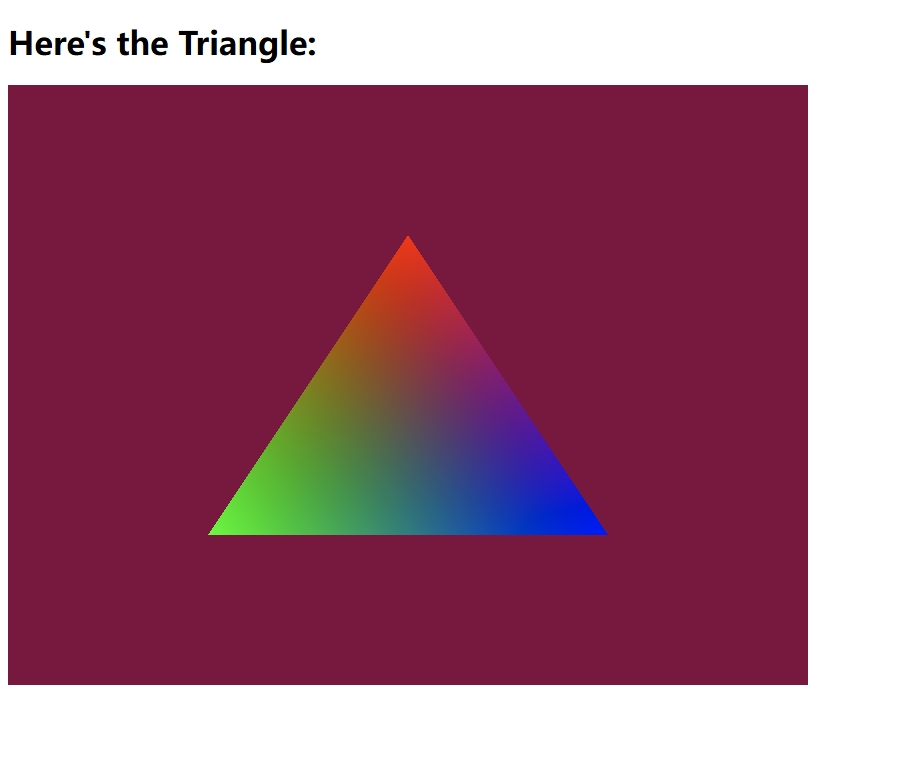

# WebGPU Application Template

A starter template for WebGPU and TypeScript development that uses webpack to build the code and manage dependencies. You'll also need node.js installed for package management and running tasks.

## Getting Started

After cloning the repo run

```
npm install
```

To install webpack, then you can run the serve task and point your browser to `localhost:8080`:

```
npm run serve
```

where you should see the page down below.

If everything's working you should see this page in your browser when you run the application:
   
   
